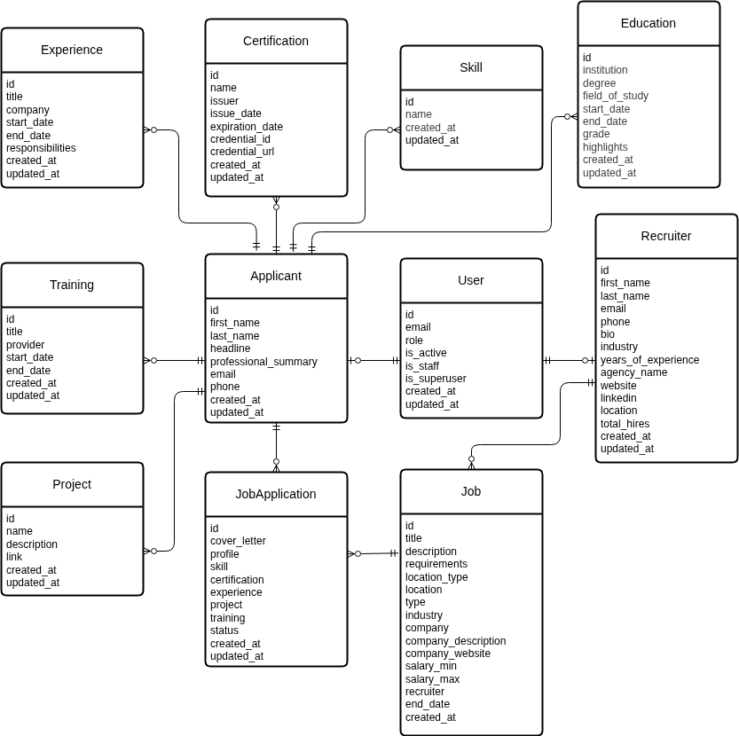

# Talent Bridge API

## Objective

The **Talent Bridge API** powers a job board platform that connects recruiters and job seekers. It exposes a RESTful backend with endpoints for managing job postings, applications, and applicant workflows.

---

## Key Features

* **Authentication & Profiles**

  * Role-based authentication for recruiters and applicants.
  * Profile management for both recruiters (company details) and applicants (personal/career details).

* **For Recruiters**

  * Create, update, and manage job listings.
  * View submitted applications and applicant profiles.
  * Accept or reject job applications.

* **For Applicants**

  * Browse and apply for job opportunities.
  * Track and manage submitted applications.
  * Maintain a profile to streamline and tailor applications.

---

## Tech Stack

* **Django:** High-level Python web framework used for building the RESTful API with built-in tools for authentication, routing, and security.
* **Django REST Framework:** Extension of Django for building, testing, and documenting APIs (serialization, permissions, authentication, versioning).
* **PostgreSQL:** Relational database system used to store structured data (users, jobs, applications, etc.).
* **Redis:** In-memory datastore for caching and session management.
* **Docker Compose:** Container orchestration for local development with PostgreSQL and Redis.

---

## Database Design



### Entities

* **Users** → Core user model with roles (Recruiter or Applicant).
* **Recruiter Profile** → Stores recruiter/company-specific details.
* **Applicant Profile** → Stores applicant’s personal and professional details.
* **Job** → Represents job listings created by recruiters.
* **JobApplication** → Represents applications submitted by applicants, including snapshots of their profile, skills, and experiences.
* **Education, Skills, Experience, Training, Certifications, Projects** → Store detailed applicant information.

### Relationships

* A user can be a **Recruiter** or **Applicant** depending on role.
* Recruiters create multiple job postings.
* Applicants can apply to multiple jobs.
* Each job can have many applications.
* Applicants can maintain multiple education records, skills, experiences, trainings, certifications, and projects.

---

## Usage

### Getting Started

Clone the repository and navigate to the project directory:

```bash
git clone <repo-url>
cd <project-folder>
```

### Installation

Install Python dependencies:

```bash
pip install -r requirements.txt
```

### Configuration

1. Copy the example environment file and create a local `.env` file:

   ```bash
   cp .env.example .env
   ```

2. Update the values in `.env` with your local configuration (database credentials, Redis URL, etc.).

### Running Locally

Spin up services (PostgreSQL & Redis) with Docker Compose:

```bash
docker compose up -d
```

Apply migrations and run the development server:

```bash
python manage.py migrate
python manage.py runserver
```

---

## API Documentation

Interactive API documentation is available at:

```file
/api/docs
```
